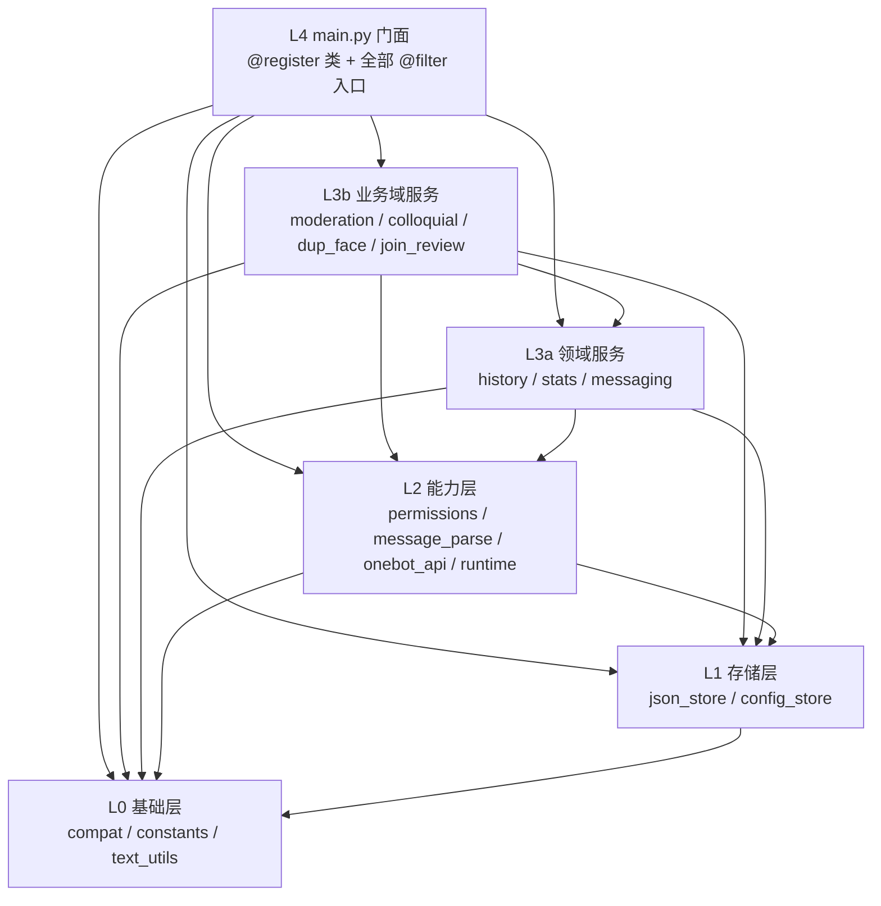

# 群管插件架构说明

> 本文档记录 AstrBot 群管插件（`astrbot_plugin_gm`）模块化重构后的最终架构、分层与依赖规则，
> 供后续维护与扩展参考。重构为**纯结构性重构，无功能变更**：全部对外契约（命令 / 事件 / 钩子 /
> 配置键 / 数据文件）保持不变。

---

## 1. 重构概览

> **后续优化（模块物理归并 + main.py 压缩）**：在不改变任何对外契约与运行结果的前提下，
> 将 `cop/target_resolver.py` 并入 `cop/message_parse.py`，将 `cop/colloquial.py`、
> `cop/dup_face.py` 合并为 `cop/conversational.py`（cop 由 22 个 .py 降为 20 个）；
> `main.py` 通过一致行为的 generator 公共体（`_set_group_int_seconds_body`、
> `_list_group_global_body`、`_edit_group_override_qqs`、`_batch_group_admin`）与
> property 工厂 `_runtime_prop` 收敛样板，行数由约 2558 降为约 2447。
> 分层、依赖方向、类名、命令契约、文案与数据路径全部保持不变。

| 项目 | 重构前 | 重构后 | 归并/压缩后 |
|------|--------|--------|--------------|
| 单体文件 | `main.py` 约 5020 行 | `main.py` 约 2558 行 | `main.py` 约 2447 行 |
| 业务逻辑位置 | 全部集中在 `main.py` | 下沉至插件私有子包 `cop/` |
| 架构形态 | 扁平单体 | 「门面 + 服务层」分层 |
| 对外接口 | 直接定义于 `main.py` | **仍全部保留在 `main.py`** |
| 方法体 | 内联实现 | 转调服务层实例（薄编排） |

`main.py` 的 `GroupAdminPlugin` 类作为**唯一门面**，保留：

- **93 个** `@filter.command` 命令入口；
- **2 个** `@filter.event_message_type` 事件钩子：`on_group_message`（`GROUP_MESSAGE`）、
  `on_group_event`（`ALL`）；
- **1 个** `@filter.after_message_sent` 钩子。

方法体不再内联业务逻辑，而是编排 `cop/` 子包中的 L3 服务实例。

---

## 2. 目录结构

```text
mjy1113451_astrbot_plugin_gm/
├── main.py                  # L4 门面：@register 类 + 全部 @filter 入口（约 2447 行）
├── metadata.yaml            # 插件元信息
├── _conf_schema.json        # 配置项 schema（本次重构未改动）
├── requirements.txt         # Python 依赖（aiohttp）
├── README.md                # 用户文档
├── CHANGELOG.md             # 变更记录
├── NOTICE / LICENSE         # 第三方声明 / AGPL-3.0
├── docs/
│   ├── ARCHITECTURE.md      # 本文件（架构说明）
│   ├── interfaces_snapshot.md
│   └── SOLUTIONS_*.md
└── cop/                     # 插件私有子包（业务逻辑）
    ├── __init__.py          # 子包说明与分层约定
    ├── compat.py            # L0 兼容导入集中
    ├── constants.py         # L0 模块级常量
    ├── text_utils.py        # L0 无状态纯函数
    ├── json_store.py        # L1 JSON 原子读写
    ├── config_store.py      # L1 配置 / 运行时映射门面
    ├── permissions.py       # L2 权限判定（PermissionService）
    ├── message_parse.py     # L2 消息解析（MessageParser）+ 目标解析（TargetResolver）
    ├── onebot_api.py        # L2 OneBot API 封装（OneBotApi）
    ├── runtime.py           # L2 可变状态容器（RuntimeState）
    ├── history.py           # L3a 历史服务（HistoryService）
    ├── stats.py             # L3a 统计服务（StatsService）
    ├── messaging.py         # L3a 消息辅助服务（MessagingService）
    ├── conversational.py    # L3b 重复表情包（DupFaceService）+ 口语化指令（ColloquialService）
    ├── join_review.py       # L3b 加群审核（JoinReviewService）
    └── moderation/          # L3b 违规检测业务域子包
        ├── __init__.py
        ├── service.py       # ModerationService（总入口）
        ├── image.py         # ImageModeration
        ├── text.py          # TextModeration
        └── voice.py         # VoiceModeration
```

> `cop/` 为 **PEP 420 命名空间包**：导入方式优先 `from .cop.xxx import ...`，
> 失败时回退 `from cop.xxx import ...`（兼容将插件目录直接加入 `sys.path` 的加载方式）。

---

## 3. 分层与依赖方向

分层遵循**单向依赖**：只允许上层依赖下层，**同层禁止互相 `import`**。



| 层级 | 模块 | 说明 |
|------|------|------|
| **L0** | [`compat.py`](../cop/compat.py)、[`constants.py`](../cop/constants.py)、[`text_utils.py`](../cop/text_utils.py) | 兼容导入、常量、无状态纯函数 |
| **L1** | [`json_store.py`](../cop/json_store.py)、[`config_store.py`](../cop/config_store.py) | JSON 原子读写、配置 / 运行时映射门面 |
| **L2** | [`permissions.py`](../cop/permissions.py)、[`message_parse.py`](../cop/message_parse.py)、[`onebot_api.py`](../cop/onebot_api.py)、[`runtime.py`](../cop/runtime.py) | 权限判定、消息解析 + 目标解析、API 封装、可变状态 |
| **L3a** | [`history.py`](../cop/history.py)、[`stats.py`](../cop/stats.py)、[`messaging.py`](../cop/messaging.py) | 历史、统计、消息辅助 |
| **L3b** | [`moderation/`](../cop/moderation/)、[`conversational.py`](../cop/conversational.py)、[`join_review.py`](../cop/join_review.py) | 违规检测、重复表情包 + 口语化指令、加群审核 |
| **L4** | [`main.py`](../main.py) | 唯一暴露 `@filter` 的门面 |

### 依赖规则

1. **只允许上层依赖下层**，禁止反向依赖；
2. **同层不互相 `import`**：跨模块调用一律由门面在构造时以实例注入
   （`TYPE_CHECKING` + 字符串注解规避运行时循环导入）；
3. **无全局单例**：所有服务均为实例，生命周期与插件实例绑定；
4. **显式依赖注入**：服务通过 `__init__(*, ...)` 关键字参数接收依赖。

---

## 4. 各模块职责

### L0 基础层

| 模块 | 主要导出 | 职责 |
|------|----------|------|
| [`compat.py`](../cop/compat.py) | `MessageChain`、`aiohttp`、`_CFG_LOCK` | 集中散落的惰性 / 多级兜底导入，保证与重构前完全相同的导入时机 |
| [`constants.py`](../cop/constants.py) | `_DEFAULT_PROFANITY_PROMPT`、`_RUNTIME_MAP_KEYS`、`_MUTE_*`、`GM_COMMAND_NAMES` | 模块级常量 |
| [`text_utils.py`](../cop/text_utils.py) | `_parse_qq_list`、`_parse_duration_minutes`、`_format_minutes` 等 | 中文数字 / 时长解析 / 格式化等纯函数 |

### L1 存储层

| 模块 | 主要导出 | 职责 |
|------|----------|------|
| [`json_store.py`](../cop/json_store.py) | `JsonStore` | 无状态 JSON 存储：容错读 + 原子写（临时文件替换） |
| [`config_store.py`](../cop/config_store.py) | `ConfigStore` | 全局配置与运行时映射（`group_overrides` / `groups` / 待审申请）的读写与按群覆盖；持有各数据文件路径，可依赖 L0 |

### L2 能力层

| 模块 | 主要导出 | 职责 |
|------|----------|------|
| [`permissions.py`](../cop/permissions.py) | `PermissionService` | 插件管理员 / 群主 / 群管理员 / 专项「设管理」名单等权限判定 |
| [`message_parse.py`](../cop/message_parse.py) | `MessageParser`、`TargetResolver` | 从事件 / 原始报文中提取文本、AT、图片、语音、命令等；并从上下文解析指令操作目标（@ / 引用 / QQ / 名字） |
| [`onebot_api.py`](../cop/onebot_api.py) | `OneBotApi` | 封装 OneBot action：消息收发、撤回、禁言、踢人等 |
| [`runtime.py`](../cop/runtime.py) | `RuntimeState` | 进程内可变状态容器（内存态 + 持久化数据引用），不含业务方法 |

### L3a 领域服务

| 模块 | 主要导出 | 职责 |
|------|----------|------|
| [`history.py`](../cop/history.py) | `HistoryService` | 撤回消息历史增删查、API 兜底加载、最近消息撤回、通知开关判定 |
| [`stats.py`](../cop/stats.py) | `StatsService` | 发言计数、排名、重置、禁言计数与阈值踢人、违规计数 |
| [`messaging.py`](../cop/messaging.py) | `MessagingService` | 命令层公共辅助（如专项管理员增删去重实现） |

### L3b 业务域服务

| 模块 | 主要导出 | 职责 |
|------|----------|------|
| [`moderation/service.py`](../cop/moderation/service.py) | `ModerationService` | 违规检测总入口：总开关 / 豁免 / 时长 / 违规处置 / 检测分发 |
| [`moderation/image.py`](../cop/moderation/image.py) | `ImageModeration` | 图片 AI 视觉审核 |
| [`moderation/text.py`](../cop/moderation/text.py) | `TextModeration` | 文本类违规检测（骂人 / 广告 / 链接 / 群号推广等） |
| [`moderation/voice.py`](../cop/moderation/voice.py) | `VoiceModeration` | 语音转文字违规检测 |
| [`conversational.py`](../cop/conversational.py) | `ColloquialService` | 口语化群管指令意图识别与处理（#254） |
| [`conversational.py`](../cop/conversational.py) | `DupFaceService` | 重复表情包自动撤回（#196） |
| [`join_review.py`](../cop/join_review.py) | `JoinReviewService` | 入群欢迎、加群请求自动审核、引用回复审批 |

### L4 门面

| 模块 | 导出 | 职责 |
|------|------|------|
| [`main.py`](../main.py) | `GroupAdminPlugin`（`@register`） | 唯一暴露 `@filter` 的模块；编排 L3 服务实例，保留极少量 glue（状态 property 转发、存储委托等） |

---

## 5. 依赖注入与装配顺序

所有服务在 [`GroupAdminPlugin.__init__`](../main.py:120) 中按**自底向上**顺序组装，
通过构造参数显式注入依赖（无全局单例）：

```mermaid
flowchart LR
    A["JsonStore (L1)"] --> B["ConfigStore (L1)"]
    B --> C["OneBotApi (L2)"]
    C --> D["MessageParser (L2)"]
    D --> E["PermissionService / TargetResolver (L2)"]
    E --> F["RuntimeState (L2)"]
    F --> G["StatsService (L3a)"]
    G --> H["HistoryService / MessagingService (L3a)"]
    H --> I["ModerationService + image/text/voice (L3b)"]
    I --> J["ColloquialService / DupFaceService / JoinReviewService (L3b)"]
```



关键装配约束：

- **`stats` 必须先于 `moderation` 构造**：[`ModerationService`](../cop/moderation/service.py:39) 的
  `_handle_violation` **单向调用** `StatsService._record_mute_and_maybe_kick`。此为跨层依赖，
  通过实例注入而非模块 `import`，已消除历史上 `moderation → stats` 的循环依赖（保持单向）。
- **moderation 子模块先构造后注入**：`ImageModeration` / `TextModeration` / `VoiceModeration`
  为 `moderation` 同层子模块，先独立构造，再以关键字参数注入 `ModerationService`。
- **RuntimeState 承载可变状态**：`main.py` 通过同名 property 转发
  `self.stats` / `self.message_history` / `self.spam_records` 等，使原调用点零改动；
  可写字段（如 `_msg_save_counter` / `max_history`）配 setter。为避免 9 组
  getter/setter 样板重复，统一由模块级工厂 `_runtime_prop(name)` 生成，
  读写语义与逐一手写完全等价。
- **装配完成后**调用 `ConfigStore.warn_if_group_scope_empty()` 执行启动告警。

---

## 6. 关键设计约束

### 6.1 为何 `@filter` 入口必须留在 `main.py`

AstrBot 框架在注册 handler 时，**依据 `handler.__module__` 精确绑定命令**
（期望值为 `data.plugins.mjy1113451_astrbot_plugin_gm.main`）。因此：

- 所有 `@filter.command` / `@filter.event_message_type` / `@filter.after_message_sent`
  **必须**定义在 `main.py` 中，**不能**下沉到 `cop/` 子包；
- `cop/` 内模块**禁止**使用任何 `@filter` 装饰器；
- 若把入口迁移到子包，`__module__` 将变为 `...cop.xxx`，导致框架无法匹配、命令失效。

这也是本次重构将业务逻辑下沉、但**严格保留全部接口定义在 `main.py`** 的根本原因。

### 6.2 对外契约保持不变

以下内容在重构中**零变更**：

- 全部命令名 / 说明 / alias；
- 事件类型（`GROUP_MESSAGE` / `ALL`）与 `after_message_sent` 钩子；
- `@register` 参数；
- 数据文件路径与结构：`runtime.json` / `stats.json` / `reports.json` / `config.json`；
- 全部配置 key（`_conf_schema.json` 未改动）；
- 异步 / 生成器方法的形态。

### 6.3 已知既有行为（非本次重构引入，本次未改）

- `GM_COMMAND_NAMES` 含 **95** 项，与实际 **93** 个命令存在差异
  （仅名单有：`别人昵称`、`改群昵称`、`群名称`、`群昵称`、`设群友昵称`；
  仅装饰器有：`开关链接检测`、`新人加群申请通知`、`重复表情包撤回`），详见
  [`docs/interfaces_snapshot.md`](interfaces_snapshot.md)。
- `data_dir` 存在双层嵌套。

> 上述均为**既有行为，本次重构未改动**。
>
> 后续变更（#229）：`新人加群申请通知` 指令（`join_request_notify_enabled`，#205）已随配置去重删除，
> 并新增 `加群自动拒绝关键词`。因此 `GM_COMMAND_NAMES` 现为 **96** 项、`@filter.command` 仍为 **93** 个，
> 「仅装饰器有」列表仅剩 `开关链接检测`、`重复表情包撤回`（以
> [`docs/interfaces_snapshot.md`](interfaces_snapshot.md) 为准）。

---

## 7. 如何扩展

### 7.1 新增一个命令

1. 在 `cop/` 中合适的层级实现业务方法（遵循分层规则与依赖注入约定）；
2. 在 [`main.py`](../main.py) 的 `GroupAdminPlugin` 内新增 `@filter.command` 方法
   （**入口必须留在 `main.py`**），方法体编排对应服务实例；
3. 若需要新服务依赖，在 `__init__` 中按序构造并以关键字参数注入；
4. 如需对外配置，在 `_conf_schema.json` 中新增 key（本文件属外部契约，修改需谨慎）；
5. 运行 `py_compile` 与冒烟验证，确认 `__module__` 不变、接口契约无差异。

### 7.2 新增一种检测类型

1. 优先在 [`cop/moderation/text.py`](../cop/moderation/text.py) 或新建同域子模块中实现检测逻辑；
2. 若为新的媒体维度（如图片 / 语音细分），可仿照 [`moderation/image.py`](../cop/moderation/image.py) 新增独立子模块，
   并在 [`moderation/__init__.py`](../cop/moderation/__init__.py) 导出；
3. 在 [`ModerationService`](../cop/moderation/service.py) 的检测分发中接入，保持 **moderation → stats 单向**；
4. 若新增处置动作，复用 `OneBotApi`（撤回 / 禁言）与 `StatsService._record_violation`，避免跨层 `import`；
5. 保持既有配置 key 语义不漂移，必要时在 `_conf_schema.json` 补充开关项。

### 7.3 如何测试各服务

- **单元级**：因服务通过构造注入依赖，可在测试中传入轻量替身（stub / fake）实例，
  无需启动 AstrBot 框架即可验证纯逻辑（尤其 L0 纯函数、L1 存储、L3 业务域）。
- **导入级**：验证 `from .cop.xxx import ...` 与 `from cop.xxx import ...` 两种路径均可用，
  且模块 `__module__` 符合框架期望。
- **契约级**：以 [`docs/interfaces_snapshot.md`](interfaces_snapshot.md) 为基线，
  校验 93 命令 / 2 事件 / 1 钩子数量与名称零差异。
- **依赖级**：检查各层 `import` 方向，确保无同层互相 `import`、无循环依赖、无悬空调用。
- **冒烟级**：对关键行为（禁言 / 撤回 / 违规处置）与降级路径（如 OneBot 接口不可用时的兜底）
  执行冒烟测试。

---

## 8. 重构验证结论

本次重构已完成以下验证，均通过：

- `py_compile` 全部通过；
- 框架等价 `import` 成功且 `__module__` 不变；
- 93（命令）/ 2（事件）/ 1（钩子）接口契约**零差异**；
- **零循环依赖**、**零悬空调用**；
- 关键行为冒烟与降级路径通过。

> 结论：本次为**纯重构，无功能变更**，对外行为与接口保持一致。

### 归并 + 压缩阶段验证结论

- `py_compile` 全部 `.py` 通过；`import data.plugins.mjy1113451_astrbot_plugin_gm.main`
  成功且 `GroupAdminPlugin.__module__` 仍为 `data.plugins.mjy1113451_astrbot_plugin_gm.main`；
- AST 复核：`@filter.command` 93、`@filter.event_message_type` 2、`@filter.after_message_sent` 1；
  命令名 / 说明 / alias 与 [`interfaces_snapshot.md`](interfaces_snapshot.md) 逐项一致；
- 依赖健康：cop 20 模块无悬空 import、无同层互相 import、无环；
- 关键行为回归 22/22 通过（property 读写、时长设置、本群/全局列表、@目标增删、
  批量群管理文案、bool 开关、重复表情包撤回、口语化 5 类意图、阈值踢人、
  `MessageChain`/`aiohttp` 兼容常量降级路径）。

> 结论：归并与压缩均为**纯结构优化，无功能变更**；命令体收敛到一致行为的公共体，
> 文案、阈值、retry / sleep / retcode 判定与降级路径逐字不变。
